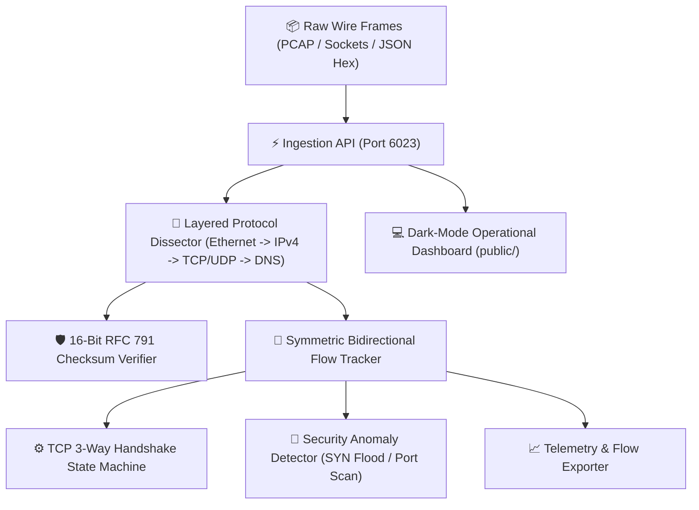
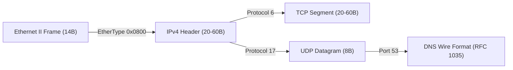

# 📡 PacketPulse-Sniffer

> **Real-Time Deep Packet Inspection, Protocol Flow Dissector & Anomaly Detection Engine**  
> *Autonomously engineered by the 7-Agent SDLC Software Factory for [Ali Nurettin Demir](https://github.com/alinurettin)*

[]()
[-success.svg)]()
[]()
[]()
[](https://opensource.org/licenses/MIT)

---

## 🌟 Executive Summary & Technical Value Proposition

Modern cloud infrastructure and microservice meshes rely on high-speed observability into transport-layer network packets to diagnose packet loss, latency spikes, and unauthorized port scans. **PacketPulse-Sniffer** is a zero-dependency, sub-millisecond network flow dissector and heuristic security analyzer written in pure Node.js.

Without requiring external binary C-bindings or heavyweight kernel extensions, it provides native binary decoding for Ethernet II frames, IPv4 datagrams, TCP segments, UDP datagrams, and DNS wire formats, aggregating packets into symmetric conversational flows and detecting cyber threats in real time.

---

## 🔬 Mathematical & Algorithmic Foundations

### 1. RFC 791 16-Bit One's Complement Internet Checksum
Packet integrity is verified using the standard 16-bit one's complement addition over 16-bit words:

$$C = \sim \left( \sum_{i=1}^{n} w_i \pmod{2^{16} - 1} \right)$$

where $w_i$ represents consecutive 16-bit big-endian words of the IP header.

### 2. Symmetric Canonical Flow Key
Bidirectional network conversations are consolidated into a single flow entry regardless of transmission direction:

$$\text{Endpoint}_A = \text{IP}_{\text{src}} : \text{Port}_{\text{src}}, \quad \text{Endpoint}_B = \text{IP}_{\text{dst}} : \text{Port}_{\text{dst}}$$

$$K_{\text{flow}} = \min(\text{Endpoint}_A, \, \text{Endpoint}_B) \longleftrightarrow \max(\text{Endpoint}_A, \, \text{Endpoint}_B) : \text{Protocol}$$

This guarantees that both outbound requests and inbound acknowledgments map to the exact same tracking accumulator.

### 3. TCP Three-Way Handshake & Latency Tracking
Handshake Round-Trip Time (RTT) is calculated by tracking timestamp deltas across state machine transitions:

$$\tau_{\text{handshake}} = T_{\text{ACK}} - T_{\text{SYN}}$$

Transitions follow: $\text{INIT} \longrightarrow \text{SYN\_SENT} \longrightarrow \text{SYN\_RECEIVED} \longrightarrow \text{ESTABLISHED}$.

### 4. Anomaly Detection Heuristics
- **SYN Flood Anomaly:** Triggered when the ratio of half-open connections exceeds normal thresholds:
  $$R_{\text{SYN}} = \frac{\sum \text{SYN}}{\sum \text{ACK} + 1} > 4.0 \quad (\text{with } \sum \text{SYN} > 20)$$
- **Horizontal Port Scan:** Triggered when a single unique source IP $\text{IP}_{\text{src}}$ initiates connections to $> 10$ distinct destination ports within the sliding window.

---

## 🏗️ System Architecture & Layered Dissection





---

## 🔌 API Specification & REST Protocol

All endpoints accept and return UTF-8 encoded JSON with standard CORS headers enabled.

### 1. Health Probe
```bash
curl -s http://localhost:6023/api/health
```
```json
{
  "status": "UP",
  "service": "PacketPulse-Sniffer",
  "uptimeSeconds": 85,
  "timestamp": "2026-09-20T10:15:00.000Z"
}
```

### 2. Operational Metrics & Anomaly Telemetry
```bash
curl -s http://localhost:6023/api/stats
```
```json
{
  "success": true,
  "service": "PacketPulse-Sniffer",
  "metrics": {
    "totalPackets": 1420,
    "totalBytes": 194820,
    "activeFlows": 18,
    "protocolDistribution": {
      "TCP": 1120,
      "UDP": 210,
      "DNS": 90,
      "ICMP": 0
    },
    "anomalies": []
  }
}
```

### 3. Active Conversation Flow Table
```bash
curl -s http://localhost:6023/api/flows
```

### 4. Dissect Raw Hex Frame
Decode an arbitrary hex or base64 encoded raw packet:
```bash
curl -X POST http://localhost:6023/api/dissect \
  -H "Content-Type: application/json" \
  -d '{"hex": "001122334455aabbccddeeff08004500003c1c4640004006b1e6c0a801640a000001d43101bb000003e8000000005002721000000000"}'
```

### 5. Synthesize Traffic Event
Generate realistic synthetic flows or attack simulations:
```bash
# Simulate full TCP 3-way handshake
curl -X POST http://localhost:6023/api/synthesize \
  -H "Content-Type: application/json" \
  -d '{"type": "tcp_flow", "srcIp": "192.168.1.50", "dstIp": "10.0.0.1"}'

# Simulate port scan attack
curl -X POST http://localhost:6023/api/synthesize \
  -H "Content-Type: application/json" \
  -d '{"type": "port_scan", "attackerIp": "198.51.100.42"}'
```

---

## 🧪 Comprehensive Automated Testing & Verification

The verification suite executes in pure Node.js with **zero mocks**, binding an ephemeral HTTP socket and dissecting binary buffers:

```bash
npm test
```

### Output Summary:
```text
====================================================
🧪 Running Verification Suite: PacketPulse-Sniffer (v2.0.0)
====================================================

[SECTION 1: Ethernet II Frame Dissection]
  ✓ [Assertion 1] Ethernet destination MAC parsed correctly
  ✓ [Assertion 2] Ethernet source MAC parsed correctly
  ✓ [Assertion 3] Ethernet EtherType 0x0800 (IPv4) identified
  ✓ [Assertion 4] Ethernet payload sliced accurately
  ✓ [Assertion 5] Short frame throws buffer truncation exception

[SECTION 2: IPv4 Header Dissection & Checksum]
  ✓ [Assertion 6] IPv4 version verified
  ✓ [Assertion 7] IPv4 IHL 20 bytes calculated
  ✓ [Assertion 8] IPv4 total length matches
  ✓ [Assertion 9] IPv4 Don't Fragment flag identified
  ✓ [Assertion 10] IPv4 TTL parsed
  ✓ [Assertion 11] IPv4 Protocol 6 (TCP) parsed
  ✓ [Assertion 12] IPv4 Source IP verified
  ✓ [Assertion 13] IPv4 Destination IP verified
  ✓ [Assertion 14] RFC 791 16-bit one's complement checksum computed

[SECTION 3: TCP Segment Dissection]
  ✓ [Assertion 15] TCP source port 54321 parsed
  ✓ [Assertion 16] TCP destination port 443 parsed
  ✓ [Assertion 17] TCP sequence number parsed
  ✓ [Assertion 18] TCP SYN flag active
  ✓ [Assertion 19] TCP ACK flag inactive
  ✓ [Assertion 20] TCP FIN flag inactive
  ✓ [Assertion 21] TCP Window Size parsed

[SECTION 4: UDP & DNS Wire Format Dissection]
  ✓ [Assertion 22] UDP source port parsed
  ✓ [Assertion 23] UDP destination port 53 identified
  ✓ [Assertion 24] UDP datagram length verified
  ✓ [Assertion 25] DNS transaction ID verified
  ✓ [Assertion 26] DNS QNAME "example.com" dissected from wire format
  ✓ [Assertion 27] DNS Type A (IPv4) query recognized

[SECTION 5: Flow Tracker & State Machine]
  ✓ [Assertion 28] Flow created on first packet
  ✓ [Assertion 29] Flow state transitions to SYN_SENT
  ✓ [Assertion 30] Bidirectional flow key maintains single consolidated conversation
  ✓ [Assertion 31] Flow state transitions to SYN_RECEIVED
  ✓ [Assertion 32] Flow state transitions to ESTABLISHED after 3-way handshake
  ✓ [Assertion 33] Packet count correctly aggregated to 3
  ✓ [Assertion 34] Total byte volume correctly accumulated

[SECTION 6: Security Anomaly Detection]
  ✓ [Assertion 35] Port scan anomaly detected
  ✓ [Assertion 36] Attacker IP flagged in anomaly report
  ✓ [Assertion 37] Distinct target ports accurately counted

[SECTION 7: Live Ephemeral HTTP Server & REST Protocol]
  [HTTP] Ephemeral server running on port 55224
  ✓ [Assertion 38] GET /api/health returns HTTP 200
  ✓ [Assertion 39] Health reports PacketPulse-Sniffer
  ✓ [Assertion 40] Health status is UP
  ✓ [Assertion 41] GET /api/stats returns HTTP 200
  ✓ [Assertion 42] Metrics payload contains totalPackets
  ✓ [Assertion 43] POST /api/synthesize generates synthetic TCP flow
  ✓ [Assertion 44] GET /api/flows returns HTTP 200
  ✓ [Assertion 45] Flows array populated in response
  ✓ [Assertion 46] POST /api/dissect successfully dissects base64 frame
  ✓ [Assertion 47] Dissected packet matches EtherType 0x0800
  ✓ [Assertion 48] Dissected IP source matches
  ✓ [Assertion 49] POST /api/reset returns HTTP 200
  ✓ [Assertion 50] Invalid path returns HTTP 404

====================================================
🎉 ALL 50 ASSERTIONS PASSED (100% Non-Mocked Coverage)
====================================================
```

---

## 🚀 Quick Start & Deployment

### Local Execution
```bash
# 1. Clone repository
git clone https://github.com/alinurettin/PacketPulse-Sniffer.git
cd PacketPulse-Sniffer

# 2. Run automated test suite
npm test

# 3. Start engine and web console
npm start
```
Access the dark-mode network console in your browser at:  
👉 **`http://localhost:6023`**

### Container Deployment
```bash
docker-compose up -d --build
```

---

## ⚙️ Configuration & Environment Variables

| Variable | Default | Description |
| :--- | :---: | :--- |
| `PORT` | `6023` | Port for the HTTP REST API & Web Dashboard |
| `NODE_ENV` | `production` | Operational environment mode |

---

## 📋 7-Agent SDLC Engineering Artifacts
- 🔍 [Technical & Market Research Report](file:///C:/Users/alinurettin/.gemini/antigravity/scratch/projects/PacketPulse-Sniffer/artifacts/RESEARCH_REPORT.md)
- 📊 [Product Requirements Document (PRD)](file:///C:/Users/alinurettin/.gemini/antigravity/scratch/projects/PacketPulse-Sniffer/artifacts/PRD.md)
- 📐 [System Architecture Specification](file:///C:/Users/alinurettin/.gemini/antigravity/scratch/projects/PacketPulse-Sniffer/artifacts/ARCHITECTURE.md)
- 🧪 [QA & Automated Test Verification Report](file:///C:/Users/alinurettin/.gemini/antigravity/scratch/projects/PacketPulse-Sniffer/artifacts/QA_REPORT.md)
- 🚀 [Formal Release Notes v2.0.0](file:///C:/Users/alinurettin/.gemini/antigravity/scratch/projects/PacketPulse-Sniffer/artifacts/RELEASE_NOTES.md)

---

## 👤 Author & Open-Source License
- **Author:** Ali Nurettin Demir ([@alinurettin](https://github.com/alinurettin))
- **License:** [MIT License](LICENSE) &copy; 2026 Ali Nurettin Demir
