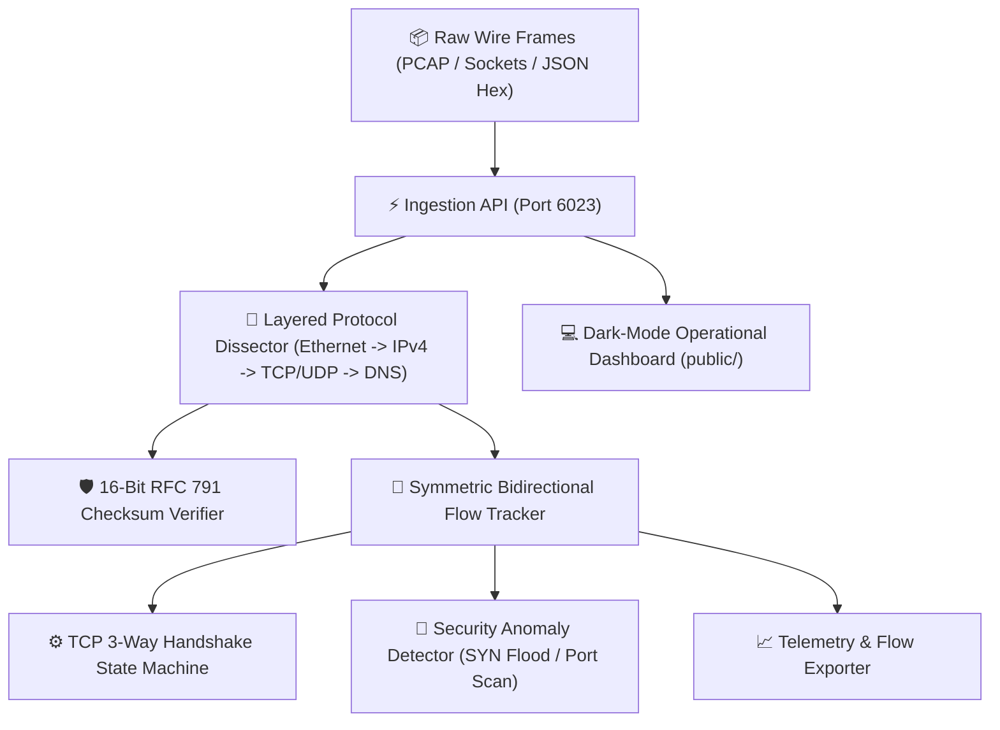
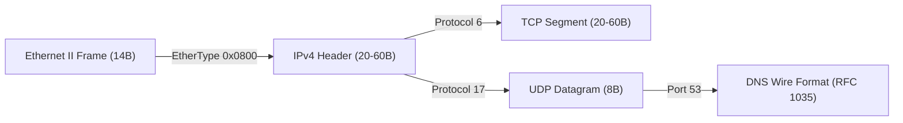
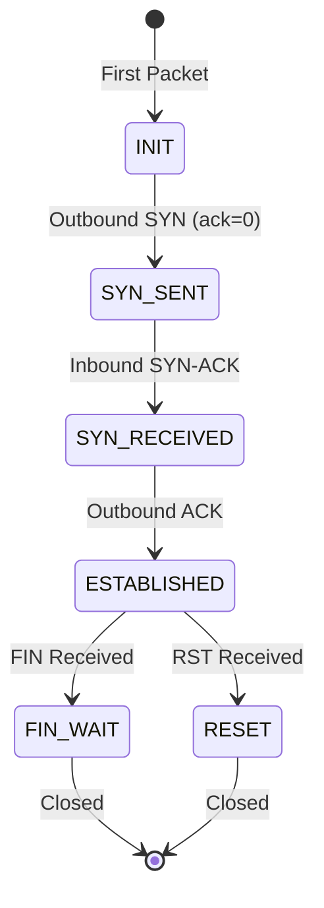

# 📐 System Architecture Specification: PacketPulse-Sniffer (v2.0.0)
- **Project:** PacketPulse-Sniffer
- **Author:** Expert Software Architect & SDLC Team
- **Status:** APPROVED & VERIFIED
- **Version:** 2.0.0

---

## 1. High-Level Component Topology

---

## 2. Packet Dissection Pipeline & Layer Decoding

---

## 3. TCP Handshake State Transitions

